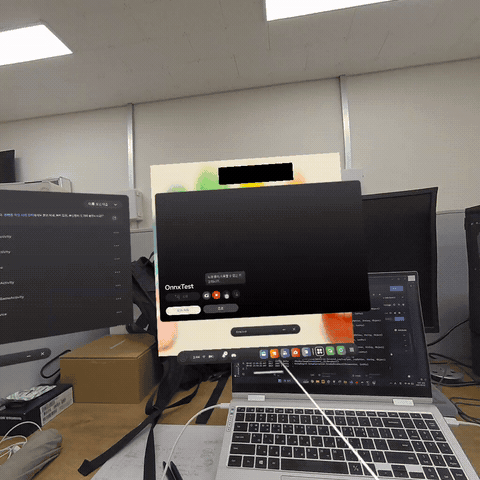
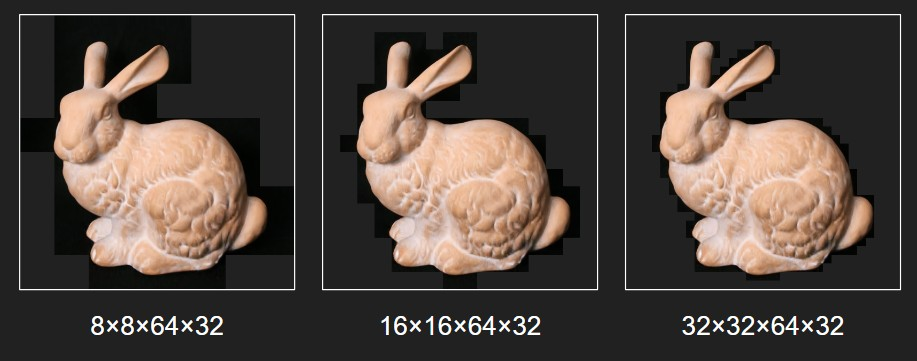

# NeLF-XR
Meta Quest 3 환경에서 사용자 시점 변화에 대응하는
**Neural Light Field(NeLF) 기반 XR 렌더링 및 모델 경량화 프로젝트**입니다.




## 프로젝트 소개
- PyTorch 기반 NeLF 모델 학습
- 학습 모델 ONNX 변환 및 Unity 연동
- Meta Quest 3 헤드 모션 기반 시점 변화 구현
- 모바일 XR 환경을 위한 NeLF 모델 경량화
- 4D Binary Mask 기반 foreground MLP 추론 구현

## 주요 성과
- Meta Quest 3 기반 On-device XR Rendering 성능 개선
- 초기 모델 대비 추론 시간 **400ms → 110ms → 60ms** (**약 85% 감소**)
- **IEICE 국제 학술지 제1저자** 논문 게재 확정

## 개발 환경
- **Language** : Python, C#
- **Framework** : PyTorch
- **Engine** : Unity 2023.2.20f1
- **Device** : Meta Quest 3
- **IDE** : Visual Studio Code
- **CUDA** : 11.8

## 모델 학습 환경
- **Dataset** : Stanford Light Field Dataset
- **GPU** : NVIDIA RTX A6000
- **Epochs** : 1000
- **Initial Learning Rate** : 1e-3
- **LR Decay** : 0.995 / epoch

## 프로젝트 구조
```text
NeLF-XR/
├── training/      # NeLF 모델 학습 및 평가 코드
├── models/        # 학습 모델
├── models_fg/     # Foreground 학습 모델
├── preds/         # 해상도별 Prediction 결과
├── unity/         # Unity XR 프로젝트
└── README.md
